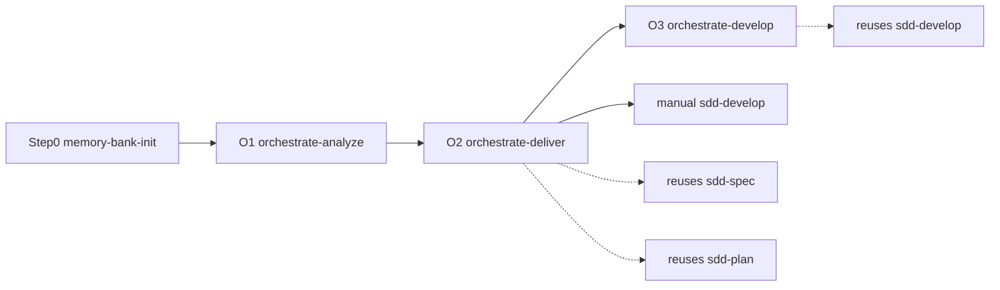

# cursor-dev-toolkit

Personal Cursor IDE agent toolkit: SDD workflows (Formas A / B / C), .NET guidelines, Git developer flow, Caveman response compression, and optional hooks. **Public** — clone and fork freely; **no upstream contributions** (see [CONTRIBUTING.md](CONTRIBUTING.md)).

Deploy to your user profile with the toolkit CLI (see [docs/INSTALL.md](docs/INSTALL.md)).

## What this is

| Capability | Description |
|------------|-------------|
| **SDD workflow** | Classic Forma A (`sdd-spec` -> `sdd-plan` -> `sdd-develop`), Forma B backlog prep, Forma C orchestration; manifest v2 storage |
| **Enforcement** | `guardrails.mdc`, session gates, `validate-all.ps1` smoke test |
| **.NET guidelines** | `dotnet-guidelines` (Clean Architecture, xUnit, Moq, FluentAssertions) |
| **Git flow** | Branching, commits, push; PRs via GitHub web UI |
| **Cursor-native** | Sync to `~/.cursor/` (skills, rules, hooks, router) |
| **Operational skills** | EF migrations, repair-dotnet-build, test-coverage, repo docs, story refine/checklist, message-handler scaffold |
| **Caveman Mode** | Optional response compression mode to reduce token usage and speed up interactions |

## Quick start

1. Clone this repo.
2. From repo root, run the toolkit CLI (sync + menu):

   **Windows (PowerShell):**

   ```powershell
   .\scripts\toolkit.ps1
   ```

   **macOS / Linux (requires [PowerShell 7+](https://learn.microsoft.com/powershell/scripting/install/installing-powershell)):**

   ```bash
   ./scripts/toolkit.sh
   ```

   Full deploy details: **[docs/INSTALL.md](docs/INSTALL.md)**. Other scripts (`sync-cursor`, `validate-all`, uninstall) are documented there.

3. For **daily skill usage**, open **[docs/guides/README.md](docs/guides/README.md)** (decision tree + guides).
4. Pick a workflow (details in the guides):

   | Forma | When | Invoke |
   |-------|------|--------|
   | **A** Classic | One clear feature | `/sdd-spec` → `/sdd-plan` → `/sdd-develop - <plan-path> - Step N` |
   | **B** Backlog | Rough bug/story first | `/refine-story` → optional `/split-story-checklist` → A or C |
   | **C** Orchestrated | Multi-story / brownfield | Step 0 `/memory-bank-init` → `/orchestrate-analyze` → `/orchestrate-deliver` → `/orchestrate-develop` **or** `/sdd-develop` |

## Forma C (orchestration)

Forma C is the **multi-agent** path. Orchestrators do **not** replace `sdd-*`; they **invoke the same contracts**:



| Stage | Skill | What it does |
|-------|-------|----------------|
| Step 0 | `memory-bank-init` | Healthy `memory-bank/` gate (required for C; not for A) |
| O1 | `orchestrate-analyze` | Triage, optional specialists, US/TS backlog + CONTINUITY |
| O2 | `orchestrate-deliver` | PRD + PLAN **per story** via `sdd-spec` / `sdd-plan` contracts |
| O3 | `orchestrate-develop` | One PLAN step per subagent via `sdd-develop` contract (or run `/sdd-develop` yourself) |

Full manual: [docs/guides/10-forma-c-orquestracao.md](docs/guides/10-forma-c-orquestracao.md).

Re-run toolkit sync after pulling updates (idempotent).

## Documentation

| Doc | Content |
|-----|---------|
| [docs/guides/README.md](docs/guides/README.md) | **Daily usage** - decision tree, skill manuals (guides 01-12) |
| [docs/INSTALL.md](docs/INSTALL.md) | Install, sync, short usage index |
| [docs/README.md](docs/README.md) | Documentation index |
| [docs/HOOKS.md](docs/HOOKS.md) | Optional hooks (behavior, limits) |
| [docs/MAINTAINER_GUIDE.md](docs/MAINTAINER_GUIDE.md) | Repository layout and maintainer checklist |
| [docs/SKILLS.md](docs/SKILLS.md) | Canonical skill catalog (35 skills) |
| [docs/PORTABILITY.md](docs/PORTABILITY.md) | Cursor-specific vs reusable contract |
| [docs/DESIGN-DECISIONS.md](docs/DESIGN-DECISIONS.md) | Design rationale (why Formas, pwsh, no CLI) |
| [docs/REPO_GOVERNANCE.md](docs/REPO_GOVERNANCE.md) | Public policy + maintainer rulesets |
| [CONTRIBUTING.md](CONTRIBUTING.md) | Clone/fork OK; no community PRs |
| [docs/impeccable-integration.md](docs/impeccable-integration.md) | Impeccable design -> DESIGN-BRIEF -> stack developer handoff |
| [docs/blip-plugin-integration.md](docs/blip-plugin-integration.md) | Blip plugin scaffold -> SDD -> `react-developer` + `blip-guidelines/` |
| [docs/architecture.md](docs/architecture.md) | Deployment and enforcement model |
| [docs/shared-guidelines.md](docs/shared-guidelines.md) | Index of `_shared/` packs |
| [docs/ENFORCEMENT.md](docs/ENFORCEMENT.md) | Rules, hooks, session gates |
| [AGENTS.md](AGENTS.md) | Agent router (synced to `~/.cursor/`) |

## Repository layout

```
cursor-dev-toolkit/
├── .github/               # workflows/, PULL_REQUEST_TEMPLATE.md
├── AGENTS.md
├── CONTRIBUTING.md
├── README.md
├── docs/                  # INSTALL, guides/, HOOKS, MAINTAINER_GUIDE, REPO_GOVERNANCE, TOKEN_BUDGET
│   └── guides/            # User skill manuals (English, versioned)
├── rules/                 # -> ~/.cursor/rules/*.mdc
│   ├── caveman-mode.md    # Global response compression trigger
│   └── …
├── hooks/                 # -> ~/.cursor/hooks/ + merge hooks.json
├── scripts/               # toolkit(.ps1|.sh), sync, uninstall
│   ├── validation/
│   ├── inventory/
│   ├── maintainers/
│   └── _lib/
└── skills/                # -> ~/.cursor/skills/ (35 skills + _shared)
    ├── sdd-spec/, sdd-plan/, sdd-develop/
    ├── memory-bank-init/
    ├── orchestrate-analyze/, orchestrate-deliver/, orchestrate-develop/
    ├── code-review/, commit/, push/
    ├── developer/         # Stack router
    ├── impeccable/
    ├── blip-plugin-developer/
    ├── *-developer/       # dotnet, react, react-native, angular, vue, blazor, electron, js, python
    ├── ef-add-migration/, repair-dotnet-build/, test-coverage/
    ├── document-plan/, document-implement/
    ├── refine-story/, split-story-checklist/
    ├── scaffold-message-handler/
    ├── refactor/, api-integrate/, performance-profile/, containerize/, i18n-manager/
    └── _shared/
```

## Skills (after sync)

| Skill | Invoke | Use for |
|-------|--------|---------|
| `sdd-spec` | `/sdd-spec` | PRD from a feature request |
| `sdd-plan` | `/sdd-plan` | Baby-step PLAN from PRD |
| `sdd-develop` | `/sdd-develop` | One PLAN step per session |
| `memory-bank-init` | `/memory-bank-init` | Forma C Step 0 - create/refresh `memory-bank/` |
| `orchestrate-analyze` | `/orchestrate-analyze` | Forma C O1 - multi-story analyze / backlog |
| `orchestrate-deliver` | `/orchestrate-deliver` | Forma C O2 - PRD/PLAN per story |
| `orchestrate-develop` | `/orchestrate-develop` | Forma C O3 - one PLAN step per subagent |
| `code-review` | `/code-review` | Review diff or branch vs PRD/PLAN |
| `commit` | `/commit` | Conventional commit |
| `push` | `/push` | Safe git push after confirmation |
| `developer` | `/developer` | Stack router for small tasks |
| `impeccable` | `/impeccable` | UI design; shape -> DESIGN-BRIEF |
| `blip-plugin-developer` | `/blip-plugin-developer` | New Blip React plugin scaffold |
| `dotnet-developer` | `/dotnet-developer` | Small .NET work without full SDD |
| `blazor-developer` | `/blazor-developer` | Small Blazor UI work |
| `react-developer` | `/react-developer` | Small React work |
| `react-native-developer` | `/react-native-developer` | Small React Native / Expo work |
| `angular-developer` | `/angular-developer` | Small Angular work |
| `vue-developer` | `/vue-developer` | Small Vue 3 work |
| `electron-developer` | `/electron-developer` | Small Electron desktop work |
| `javascript-developer` | `/javascript-developer` | Small Node/JS work |
| `python-developer` | `/python-developer` | Small Python work |
| `ef-add-migration` | `/ef-add-migration` | EF Core migration in the open repo |
| `repair-dotnet-build` | `/repair-dotnet-build` | Fix build/test failures (local; pasted CI logs) |
| `test-coverage` | `/test-coverage` | .NET coverage report (Coverlet; SonarQube-aligned metrics) |
| `document-plan` | `/document-plan` | Plan repo documentation (RAG-oriented) |
| `document-implement` | `/document-implement` | Execute one doc plan step |
| `refine-story` | `/refine-story` | Refine bug/story + quality scorecard |
| `split-story-checklist` | `/split-story-checklist` | Implementation task checklist (local markdown) |
| `scaffold-message-handler` | `/scaffold-message-handler` | Scaffold message handler (MassTransit/RMQ default) |
| `refactor` | `/refactor` | Safe incremental refactoring |
| `api-integrate` | `/api-integrate` | Typed clients from OpenAPI |
| `performance-profile` | `/performance-profile` | Profiling and hot-path optimization |
| `containerize` | `/containerize` | Dockerfiles and compose |
| `i18n-manager` | `/i18n-manager` | Extract strings to localization files |

Optional flows: Forma C (`memory-bank-init` -> `orchestrate-*`); repo docs (`document-plan` -> `document-implement`); backlog (`refine-story` -> `split-story-checklist` -> Forma A or C); frontend design (`impeccable shape` -> `DESIGN-BRIEF.md` -> `*-developer`); Blip plugin (`blip-plugin-developer` -> SDD -> `react-developer`). See [AGENTS.md](AGENTS.md).

Details and shared assets: [docs/MAINTAINER_GUIDE.md](docs/MAINTAINER_GUIDE.md).

## Conventions

| Area | Rule |
|------|------|
| Skill names | English, kebab-case (`sdd-spec`, `sdd-plan`, `orchestrate-analyze`) |
| SDD agent artifacts (PRD, PLAN `.md`) | Brazilian Portuguese (pt-BR) - `rules/sdd-artifact-language-pt-br.md` |
| Production code & tests | English; tests `Should_<Result>_When_<Condition>` |
| Project docs (`docs/`, README deliverables) | Ask pt-BR or English in skill |
| Test stack | xUnit + Moq + FluentAssertions |
| User chat replies | Brazilian Portuguese (pt-BR) - `rules/user-language-pt-br.md` |
| SDD Storage Mode | Local `repository` (in-repo) or `global` (centralized `~/.cursor/sdd/`) resolved via `manifest.json` |

## Rules (after sync)

| Source | Installed | When |
|--------|-----------|------|
| `rules/ai-stealth.md` | `~/.cursor/rules/ai-stealth.mdc` | No AI authorship traces |
| `rules/guardrails.md` | `~/.cursor/rules/guardrails.mdc` | Core gates |
| `rules/conventional-commits.md` | `~/.cursor/rules/conventional-commits.mdc` | Every commit |
| `rules/branch-validation.md` | `~/.cursor/rules/branch-validation.mdc` | Before commit/push |
| `rules/context-management.md` | `~/.cursor/rules/context-management.mdc` | Multi-step SDD |
| `rules/user-language-pt-br.md` | `~/.cursor/rules/user-language-pt-br.mdc` | Always pt-BR in chat |
| `rules/sdd-artifact-language-pt-br.md` | `~/.cursor/rules/sdd-artifact-language-pt-br.mdc` | PRD/PLAN `.md` in pt-BR; code always English |
| `rules/caveman-mode.md` | `~/.cursor/rules/caveman-mode.mdc` | Compression of chat responses when enabled |

Branches: `feature/<slug>` or `feat/<id>` only - not `main`, `master`, or `develop`.

## Caveman Mode (Response Compression)

Caveman Mode is an optional feature designed to reduce output token consumption by stripping away polite filler text and verbose progress narration, while fully protecting technical facts, code blocks, and confirmation gates.

- **Persisted State**: Configured in `~/.cursor/sdd/preferences.json` under `"caveman_mode"`.
- **In-Session Toggles**: 
  - Send `caveman on` in chat to enable response compression.
  - Send `caveman off` in chat to disable response compression.
- **Participation Levels**:
  - **NEVER**: `commit` (kept verbose for safety).
  - **LITE**: `sdd-spec`, `sdd-plan` (compresses headers/preambles, but keeps questions and drafts intact).
  - **FULL**: `code-review`, `developer`, `repair-dotnet-build`, `test-coverage`, `sdd-develop` (compresses all prose to telegraphic bullet points).

For a complete explanation, see [docs/guides/07-caveman-mode.md](docs/guides/07-caveman-mode.md).

## License

[MIT](LICENSE) © 2026 Raphael Campos. See [CONTRIBUTING.md](CONTRIBUTING.md) for contribution policy (clone/fork OK; no community PRs).
