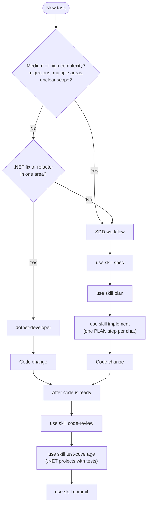

# Cursor toolkit — user guides

Step-by-step manuals for the most common skills in **cursor-dev-toolkit**. Each guide explains what to type in chat, what the agent may ask, and what to do next—without reading `SKILL.md` files under `~/.cursor/skills/`.

**Audience:** developers new to SDD in Cursor or to this toolkit.

**Language:** these guides are in English. Agent chat replies may still follow your `user-language-pt-br` rule (Brazilian Portuguese). SDD artifacts (`PRD/`, `PLAN/`) stay in pt-BR by default; application code stays English.

---

## Getting started

1. Clone this repo and deploy skills to your profile. Follow [Install — clone and deploy](../INSTALL.md#1-clone-the-toolkit) and [Verify installation](../INSTALL.md#3-verify-installation) in `docs/INSTALL.md`.
2. Open the **project you are building** in Cursor (any codebase—not only this toolkit repo).
3. Return here and use the [decision tree](#which-skill-should-i-use) below, then open the matching guide.

Re-run `scripts/sync-cursor.ps1` from the toolkit repo after `git pull` so `~/.cursor/skills/` stays up to date.

---

## Which skill should I use?

Use this tree when you start work on a change. When in doubt, prefer the SDD path (left branch)—it scales better than skipping planning.



**ASCII summary (same logic):**

```
New task
  ├─ Medium/high complexity OR unclear scope? → spec → plan → implement (1 PLAN step per session)
  ├─ Small isolated .NET change?              → dotnet-developer
  └─ After code is ready                      → code-review → test-coverage → commit
```

| Situation | Path | Guide |
|-----------|------|--------|
| Feature, migration, or cross-cutting design | `spec` → `plan` → `implement` | [01 — SDD workflow](01-sdd-workflow.md) |
| Small .NET fix/refactor, single area, no PRD | `dotnet-developer` | [02 — dotnet-developer](02-dotnet-developer.md) |
| Review before commit/merge | `code-review` | [03 — code-review](03-code-review.md) |
| Coverage report (.NET, Coverlet) | `test-coverage` | [04 — test-coverage](04-test-coverage.md) |
| Commit, fix-build, migrations, backlog, repo docs | See operational guide | [05 — operational skills](05-operational-skills.md) |

---

## Guide index

| Guide | Skills covered | Invoke examples |
|-------|----------------|-----------------|
| [01-sdd-workflow.md](01-sdd-workflow.md) | `spec`, `plan`, `implement` | `use skill spec` · `use skill plan — <prd-path>` · `use skill implement — <plan-path> — Step N` |
| [02-dotnet-developer.md](02-dotnet-developer.md) | `dotnet-developer` | `use skill dotnet-developer` |
| [03-code-review.md](03-code-review.md) | `code-review` | `use skill code-review` |
| [04-test-coverage.md](04-test-coverage.md) | `test-coverage` | `use skill test-coverage` |
| [05-operational-skills.md](05-operational-skills.md) | `commit`, `fix-build`, `add-migrations`, `plan-repo-docs`, `document-repo`, `refine-backlog-item`, `breakdown-tasks`, `create-message-consumer` | `use skill <kebab-name>` |

---

## Skills catalog (quick reference)

Aligned with [AGENTS.md](../../AGENTS.md) after sync to `~/.cursor/`.

| Skill | Invoke | Use for |
|-------|--------|---------|
| `spec` | `use skill spec` | PRD from a feature request |
| `plan` | `use skill plan` | Baby-step PLAN from PRD |
| `implement` | `use skill implement` | Execute **one** PLAN step per session |
| `code-review` | `use skill code-review` | Review diff or branch vs PRD/PLAN |
| `commit` | `use skill commit` | Conventional commit and push |
| `dotnet-developer` | `use skill dotnet-developer` | Small .NET task without full SDD |
| `add-migrations` | `use skill add-migrations` | EF Core migration in the open repo |
| `fix-build` | `use skill fix-build` | Fix `dotnet build` or test failures |
| `test-coverage` | `use skill test-coverage` | .NET coverage (Coverlet; SonarQube-aligned metrics) |
| `plan-repo-docs` | `use skill plan-repo-docs` | Documentation plan for a **consumer** repo (RAG) |
| `document-repo` | `use skill document-repo` | One step of a consumer repo doc plan |
| `refine-backlog-item` | `use skill refine-backlog-item` | Refine bug/story + scorecard (local markdown) |
| `breakdown-tasks` | `use skill breakdown-tasks` | Implementation task checklist (local) |
| `create-message-consumer` | `use skill create-message-consumer` | Scaffold message consumer (bus detected via Grep) |

**Optional flows (no work-item tracker):**

| Flow | Steps |
|------|--------|
| Repo documentation (RAG in target app) | `plan-repo-docs` → `document-repo` |
| Backlog → SDD | `refine-backlog-item` → optional `breakdown-tasks` → `spec` → `plan` → `implement` |
| Build failure | `fix-build` → optional `commit` |

> **Note:** `plan-repo-docs` / `document-repo` document **application repositories** for RAG. They are not a substitute for these **toolkit** guides under `docs/guides/`.

---

## Post-code workflow

After implementation (SDD or `dotnet-developer`), run this sequence on a valid feature branch (`feature/<slug>` or `feat/<id>`—not `main` / `master` / `develop`):

1. **`use skill code-review`** — structured report (critical / important / nice-to-have); can use PRD/PLAN from repo or `~/.cursor/sdd/<repo-id>/`.
2. **`use skill test-coverage`** — for .NET projects with tests; default threshold 80% (see guide 04).
3. **`use skill commit`** — conventional commit; optional push.

Details: [03-code-review.md](03-code-review.md), [04-test-coverage.md](04-test-coverage.md), [05-operational-skills.md](05-operational-skills.md) (`commit` section).

---

## SDD storage reminder

| Artifact | Typical location | Committed to git? |
|----------|------------------|-------------------|
| PRD / PLAN (agent workflow) | `PRD/`, `PLAN/` at repo root **or** `~/.cursor/sdd/<repo-id>/` | Usually **no** (gitignored when stored in repo) |
| User guides (this folder) | `docs/guides/` in **cursor-dev-toolkit** | **Yes** |

Full rules: `~/.cursor/skills/_shared/sdd-artifacts/STORAGE.md` (after sync). Explained in depth in [01-sdd-workflow.md](01-sdd-workflow.md).

---

## Paths in examples

Use placeholders only:

- `~/.cursor/` — installed skills, rules, hooks
- `$HOME` — user home directory
- `<repo-id>`, `<prd-path>`, `<plan-path>` — your project identifiers

Do **not** copy machine-specific absolute profile paths (Windows user folder or Linux home directory) into chat invocations.

---

## Related documentation

| Doc | Purpose |
|-----|---------|
| [../INSTALL.md](../INSTALL.md) | Install, verify, short usage tables |
| [../README.md](../README.md) | Documentation index for this repo |
| [../../README.md](../../README.md) | Toolkit overview |
| [../../AGENTS.md](../../AGENTS.md) | Agent router (synced to `~/.cursor/AGENTS.md`) |
