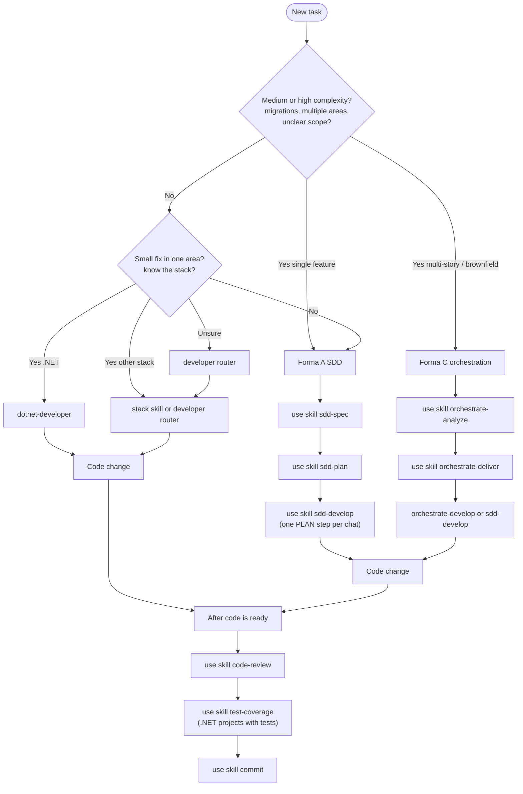

# Cursor toolkit - user guides

Step-by-step manuals for the most common skills in **cursor-dev-toolkit**. Each guide explains what to type in chat, what the agent may ask, and what to do next-without reading `SKILL.md` files under `~/.cursor/skills/`.

**Audience:** developers new to SDD in Cursor or to this toolkit.

**Language:** guides 01–09 are in English. Guide [10 - Forma C](10-forma-c-orquestracao.md) is in **pt-BR** (agent orchestration guide). Agent chat replies may still follow your `user-language-pt-br` rule (Brazilian Portuguese). SDD artifacts stay in pt-BR by default; application code stays English.

---

## Getting started

1. Clone this repo and deploy skills to your profile. Follow [Install - clone and deploy](../INSTALL.md#1-clone-the-toolkit) and [Verify installation](../INSTALL.md#3-verify-installation) in `docs/INSTALL.md`.
2. Open the **project you are building** in Cursor (any codebase-not only this toolkit repo).
3. Return here and use the [decision tree](#which-skill-should-i-use) below, then open the matching guide.

Re-run `scripts/sync-cursor.ps1` from the toolkit repo after `git pull` so `~/.cursor/skills/` stays up to date.

---

## Which skill should I use?

Use this tree when you start work on a change. When in doubt, prefer the SDD path (left branch)-it scales better than skipping planning.



**ASCII summary (same logic):**

```
New task
  ├─ Multi-story / brownfield / specialists?  -> Forma C: orchestrate-analyze -> deliver -> develop
  ├─ Medium/high complexity (single feature)? -> sdd-spec -> sdd-plan -> sdd-develop (1 step/session)
  ├─ Small isolated .NET change?              -> dotnet-developer
  ├─ Small change, other stack?               -> stack skill or developer router
  └─ After code is ready                      -> code-review -> test-coverage -> commit
```

| Situation | Path | Guide |
|-----------|------|--------|
| Feature, migration, or cross-cutting design (Forma A) | `sdd-spec` -> `sdd-plan` -> `sdd-develop` | [01 - SDD workflow](01-sdd-workflow.md) |
| Multi-story / brownfield / specialists (Forma C) | `orchestrate-analyze` -> `orchestrate-deliver` -> O3 \| `sdd-develop` | [10 - Forma C](10-forma-c-orquestracao.md) |
| Router / unknown stack | `developer` | [02 - developer](02-developer.md) |
| Small .NET fix, single area, no PRD | `dotnet-developer` | [02b - dotnet-developer](02b-dotnet-developer.md) |
| React / Angular / Vue / Blazor / Electron / JS / Python | stack skills | [08 - stack developers](08-stack-developers.md) |
| New Blip React plugin (scaffold) | `blip-plugin-developer` | [08 - stack developers](08-stack-developers.md) · [blip-plugin-integration.md](../blip-plugin-integration.md) |
| Net-new UI / visual redesign | `impeccable shape` | [08 - stack developers](08-stack-developers.md) · [impeccable-integration.md](../impeccable-integration.md) |
| Review before commit/merge | `code-review` | [03 - code-review](03-code-review.md) |
| Coverage report (.NET, Coverlet) | `test-coverage` | [04 - test-coverage](04-test-coverage.md) |
| Commit, fix-build, migrations, backlog, repo docs | See operational guide | [05 - operational skills](05-operational-skills.md) |
| Structured CLI-based specification & planning | `speckit-spec` -> `speckit-plan` -> `speckit-develop` | [06 - Spec Kit workflow](06-speckit-workflow.md) |
| Speed up chat and save token costs | Response compression | [07 - Caveman Mode](07-caveman-mode.md) |
| Scripts, sync, validation | `toolkit.ps1`, `sync-cursor.ps1` | [09 - scripts and toolkit](09-scripts-and-toolkit.md) |

---

## Guide index

| Guide | Skills covered | Invoke examples |
|-------|----------------|-----------------|
| [01-sdd-workflow.md](01-sdd-workflow.md) | `sdd-spec`, `sdd-plan`, `sdd-develop` | `use skill sdd-spec` · `use skill sdd-plan - <prd-path>` · `use skill sdd-develop - <plan-path> - Step N` |
| [02-developer.md](02-developer.md) | `developer` (router) | `use skill developer` |
| [02b-dotnet-developer.md](02b-dotnet-developer.md) | `dotnet-developer` | `use skill dotnet-developer` |
| [03-code-review.md](03-code-review.md) | `code-review` | `use skill code-review` |
| [04-test-coverage.md](04-test-coverage.md) | `test-coverage` | `use skill test-coverage` |
| [05-operational-skills.md](05-operational-skills.md) | `commit`, `fix-build`, `add-migrations`, `document-plan`, `document-implement`, `refine-backlog-item`, `breakdown-tasks`, `create-message-consumer` | `use skill <kebab-name>` |
| [06-speckit-workflow.md](06-speckit-workflow.md) | `speckit-setup`, `speckit-init`, `speckit-spec`, `speckit-plan`, `speckit-develop` | `use skill speckit-setup` · `use skill speckit-spec` |
| [07-caveman-mode.md](07-caveman-mode.md) | `caveman-mode` (rule) | `caveman on` · `caveman off` |
| [08-stack-developers.md](08-stack-developers.md) | stack `*-developer`, `blip-plugin-developer`, `impeccable` handoff | `use skill react-developer` · `use skill blip-plugin-developer` |
| [09-scripts-and-toolkit.md](09-scripts-and-toolkit.md) | sync, validate, uninstall | `.\scripts\toolkit.ps1` |
| [10-forma-c-orquestracao.md](10-forma-c-orquestracao.md) | `orchestrate-analyze`, `orchestrate-deliver`, `orchestrate-develop` (pt-BR) | `use skill orchestrate-analyze` · `use skill orchestrate-deliver - <feature-path>` · `use skill orchestrate-develop - <feature-path>` |

---

## Skills catalog (quick reference)

Aligned with [AGENTS.md](../../AGENTS.md) after sync to `~/.cursor/`.

| Skill | Invoke | Use for |
|-------|--------|---------|
| `sdd-spec` | `use skill sdd-spec` | PRD from a feature request |
| `sdd-plan` | `use skill sdd-plan` | Baby-step PLAN from PRD |
| `sdd-develop` | `use skill sdd-develop` | Execute **one** PLAN step per session |
| `orchestrate-analyze` | `use skill orchestrate-analyze` | Forma C O1 — triage + US/TS + CONTINUITY |
| `orchestrate-deliver` | `use skill orchestrate-deliver` | Forma C O2 — PRD/PLAN per story |
| `orchestrate-develop` | `use skill orchestrate-develop` | Forma C O3 — one subagent per PLAN step |
| `speckit-setup` | `use skill speckit-setup` | Verify and install Spec Kit CLI prerequisites |
| `speckit-init` | `use skill speckit-init` | Initialize `.specify/` and constitution.md in target repo |
| `speckit-spec` | `use skill speckit-spec` | Create spec.md under `.specify/specs/` |
| `speckit-plan` | `use skill speckit-plan` | Generate plan.md and tasks.md from spec |
| `speckit-develop` | `use skill speckit-develop` | Implement code and run tests for one tasks.md item |
| `code-review` | `use skill code-review` | Review diff or branch vs PRD/PLAN |
| `commit` | `use skill commit` | Conventional commit and push |
| `developer` | `use skill developer` | Stack router for small tasks |
| `impeccable` | `use skill impeccable` | UI design; `shape` -> `docs/DESIGN-BRIEF.md` |
| `blip-plugin-developer` | `use skill blip-plugin-developer` | New Blip React extension scaffold |
| `dotnet-developer` | `use skill dotnet-developer` | Small .NET task without full SDD |
| `blazor-developer` | `use skill blazor-developer` | Small Blazor UI task |
| `react-developer` | `use skill react-developer` | Small React task (incl. existing Blip plugins) |
| `angular-developer` | `use skill angular-developer` | Small Angular task |
| `vue-developer` | `use skill vue-developer` | Small Vue 3 task |
| `electron-developer` | `use skill electron-developer` | Small Electron desktop task |
| `javascript-developer` | `use skill javascript-developer` | Small Node/JS task |
| `python-developer` | `use skill python-developer` | Small Python task |
| `add-migrations` | `use skill add-migrations` | EF Core migration in the open repo |
| `fix-build` | `use skill fix-build` | Fix `dotnet build` or test failures |
| `test-coverage` | `use skill test-coverage` | .NET coverage (Coverlet; SonarQube-aligned metrics) |
| `document-plan` | `use skill document-plan` | Documentation plan for a **consumer** repo (RAG) |
| `document-implement` | `use skill document-implement` | One step of a consumer repo doc plan |
| `refine-backlog-item` | `use skill refine-backlog-item` | Refine bug/story + scorecard (local markdown) |
| `breakdown-tasks` | `use skill breakdown-tasks` | Implementation task checklist (local) |
| `create-message-consumer` | `use skill create-message-consumer` | Scaffold message consumer (bus detected via Grep) |

**Optional flows (no work-item tracker):**

| Flow | Steps |
|------|--------|
| Forma C (multi-story / brownfield) | `orchestrate-analyze` -> `orchestrate-deliver` -> `orchestrate-develop` \| `sdd-develop` |
| Repo documentation (RAG in target app) | `document-plan` -> `document-implement` |
| Backlog -> SDD (Forma B) | `refine-backlog-item` -> optional `breakdown-tasks` -> Forma A, Spec Kit, or Forma C |
| Spec Kit SDD | `speckit-setup` -> `speckit-init` -> `speckit-spec` -> `speckit-plan` -> `speckit-develop` |
| Frontend design -> implement | `impeccable shape` -> `DESIGN-BRIEF.md` -> matching `*-developer` |
| Blip plugin scaffold -> implement | `blip-plugin-developer` -> SDD or Spec Kit -> `react-developer` |
| Build failure | `fix-build` -> optional `commit` |

> **Note:** `document-plan` / `document-implement` document **application repositories** for RAG. They are not a substitute for these **toolkit** guides under `docs/guides/`.

---

## Post-code workflow

After implementation (SDD or `developer`), run this sequence on a valid feature branch (`feature/<slug>` or `feat/<id>`-not `main` / `master` / `develop`):

1. **`use skill code-review`** - structured report (critical / important / nice-to-have); can use PRD/PLAN from repo or `~/.cursor/sdd/<repo-id>/`.
2. **`use skill test-coverage`** - for .NET projects with tests; default threshold 80% (see guide 04).
3. **`use skill commit`** - conventional commit; optional push.

Details: [03-code-review.md](03-code-review.md), [04-test-coverage.md](04-test-coverage.md), [05-operational-skills.md](05-operational-skills.md) (`commit` section).

---

## SDD storage reminder

| Artifact | Typical location | Committed to git? |
|----------|------------------|-------------------|
| Feature tree (Forma A/C) | `features/NNN-slug/` **or** `~/.cursor/sdd/<repo-id>/features/NNN-slug/` | Usually **no** (gitignored when stored in repo) |
| PRD / PLAN (legacy root) | `PRD/`, `PLAN/` at repo root **or** global legacy | Usually **no**; new writes prefer `features/` |
| User guides (this folder) | `docs/guides/` in **cursor-dev-toolkit** | **Yes** |

Full rules: `~/.cursor/skills/_shared/sdd-artifacts/STORAGE.md` (after sync). Explained in depth in [01-sdd-workflow.md](01-sdd-workflow.md).

---

## Paths in examples

Use placeholders only:

- `~/.cursor/` - installed skills, rules, hooks
- `$HOME` - user home directory
- `<repo-id>`, `<prd-path>`, `<plan-path>` - your project identifiers

Do **not** copy machine-specific absolute profile paths (Windows user folder or Linux home directory) into chat invocations.

---

## Related documentation

| Doc | Purpose |
|-----|---------|
| [../INSTALL.md](../INSTALL.md) | Install, verify, short usage tables |
| [../SKILLS.md](../SKILLS.md) | Full skill catalog |
| [../impeccable-integration.md](../impeccable-integration.md) | Impeccable handoff contract |
| [../blip-plugin-integration.md](../blip-plugin-integration.md) | Blip plugin scaffold and guidelines |
| [../README.md](../README.md) | Documentation index for this repo |
| [../../README.md](../../README.md) | Toolkit overview |
| [../../AGENTS.md](../../AGENTS.md) | Agent router (synced to `~/.cursor/AGENTS.md`) |
