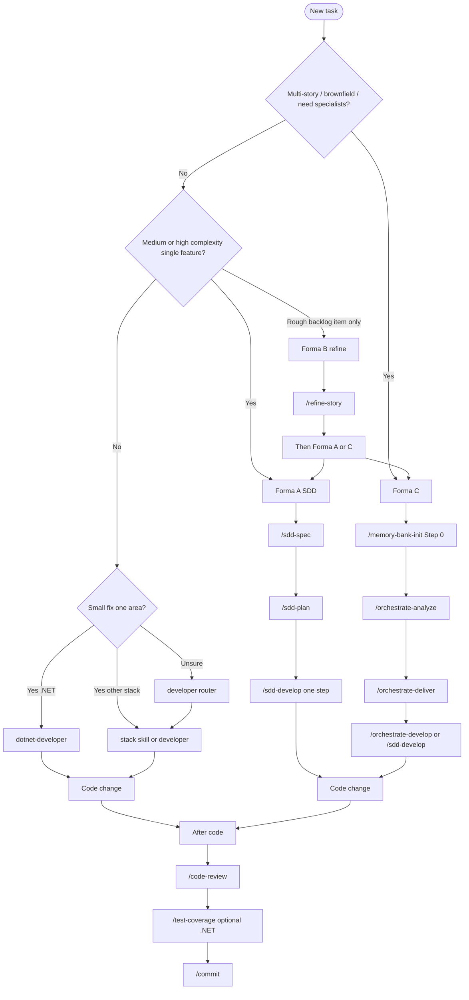

# Cursor toolkit - user guides

Onboarding hub for **cursor-dev-toolkit**. Start here after install — you should not need to read `SKILL.md` under `~/.cursor/skills/` for daily work.

**Audience:** developers new to SDD in Cursor or to this toolkit.

**Language:** guides are in English except [10 - Forma C](10-forma-c-orquestracao.md), [11 - caso NuGet](11-forma-c-caso-nuget-extract.md), and [12 - caso mobile](12-forma-c-caso-mobile-app.md) (**pt-BR**). Chat replies may follow `user-language-pt-br` (pt-BR). SDD artifacts stay pt-BR by default; application code stays English.

---

## What this toolkit is

A personal Cursor agent toolkit: **Formas A / B / C** for Spec-Driven Development, stack `*-developer` shortcuts, Git flow (commit/push + GitHub **web UI** for PRs), optional Caveman compression, and smoke validation via `validate-all.ps1`. Deploy once with `scripts/toolkit.ps1` / `sync-cursor.ps1`; then open any **consumer** project and invoke skills with `/skill-name`.

---

## Getting started

1. Clone this repo and deploy. Follow [Install](../INSTALL.md#1-clone-the-toolkit) and [Verify](../INSTALL.md#3-verify-installation).
2. Open the **project you are building** in Cursor (not only this toolkit repo).
3. Use the [decision tree](#which-skill-should-i-use) below, then open the matching guide.

Re-run `scripts/sync-cursor.ps1` after `git pull` so `~/.cursor/skills/` stays current.

---

## Which skill should I use?



**ASCII summary:**

```
New task
  ├─ Multi-story / brownfield?     -> Forma C: memory-bank-init -> O1 -> O2 -> O3|sdd-develop
  ├─ Single medium/high feature?   -> Forma A: sdd-spec -> sdd-plan -> sdd-develop
  ├─ Rough backlog item?           -> Forma B: refine-story -> checklist? -> A or C
  ├─ Small stack change?           -> *-developer or /developer
  └─ After code                    -> code-review -> test-coverage? -> commit
```

---

## Formas A / B / C (what runs underneath)

| Forma | When | Pipeline | Under the hood |
|-------|------|----------|----------------|
| **A** Classic | One clear feature | `sdd-spec` → `sdd-plan` → `sdd-develop` | Direct skills; **no** memory-bank required |
| **B** Backlog | Informal bug/story | `refine-story` → `split-story-checklist` → A or C | Prepares markdown; then hand off |
| **C** Orchestrated | Multi-story / brownfield / specialists | Step 0 → O1 → O2 → O3 \| `sdd-develop` | O2 **reuses** `sdd-spec`/`sdd-plan`; O3 **reuses** `sdd-develop` (1 step/subagent). Orchestrators do **not** write app code |

Canonical contract: `~/.cursor/skills/_shared/sdd-artifacts/PIPELINE.md` (after sync). Deep dive: [10 - Forma C](10-forma-c-orquestracao.md).

---

## Guide by situation

| Situation | Path | Guide |
|-----------|------|--------|
| Feature, migration, cross-cutting (Forma A) | `sdd-spec` → `sdd-plan` → `sdd-develop` | [01 - SDD workflow](01-sdd-workflow.md) |
| Multi-story / brownfield (Forma C) | Step 0 → O1 → O2 → O3 \| `sdd-develop` | [10 - Forma C](10-forma-c-orquestracao.md) · [11 NuGet](11-forma-c-caso-nuget-extract.md) · [12 mobile](12-forma-c-caso-mobile-app.md) |
| Router / unknown stack | `developer` | [02 - developer](02-developer.md) |
| Small .NET fix | `dotnet-developer` | [02b - dotnet-developer](02b-dotnet-developer.md) |
| React / Angular / Vue / Blazor / Electron / JS / Python | stack skills | [08 - stack developers](08-stack-developers.md) |
| New Blip React plugin | `blip-plugin-developer` | [08](08-stack-developers.md) · [blip-plugin-integration.md](../blip-plugin-integration.md) |
| Net-new UI / redesign | `impeccable shape` | [08](08-stack-developers.md) · [impeccable-integration.md](../impeccable-integration.md) |
| Review before commit | `code-review` | [03 - code-review](03-code-review.md) |
| Coverage (.NET) | `test-coverage` | [04 - test-coverage](04-test-coverage.md) |
| Commit, repair, migrations, backlog, repo docs | operational | [05 - operational skills](05-operational-skills.md) |
| Faster / cheaper chat | Caveman | [07 - Caveman Mode](07-caveman-mode.md) |
| Scripts, sync, validation, fixtures | toolkit CLI | [09 - scripts and toolkit](09-scripts-and-toolkit.md) |

---

## Guide index

| Guide | Skills covered | Invoke examples |
|-------|----------------|-----------------|
| [01-sdd-workflow.md](01-sdd-workflow.md) | `sdd-spec`, `sdd-plan`, `sdd-develop` | `/sdd-spec` · `/sdd-plan - <prd-path>` · `/sdd-develop - <plan-path> - Step N` |
| [02-developer.md](02-developer.md) | `developer` | `/developer` |
| [02b-dotnet-developer.md](02b-dotnet-developer.md) | `dotnet-developer` | `/dotnet-developer` |
| [03-code-review.md](03-code-review.md) | `code-review` | `/code-review` |
| [04-test-coverage.md](04-test-coverage.md) | `test-coverage` | `/test-coverage` |
| [05-operational-skills.md](05-operational-skills.md) | `commit`, `push`, `repair-dotnet-build`, `ef-add-migration`, `document-*`, `refine-story`, `split-story-checklist`, `scaffold-message-handler` | `/<kebab-name>` |
| [07-caveman-mode.md](07-caveman-mode.md) | caveman rule | `caveman on` · `caveman off` |
| [08-stack-developers.md](08-stack-developers.md) | `*-developer`, `blip-plugin-developer`, `impeccable` | `/react-developer` · `/blip-plugin-developer` |
| [09-scripts-and-toolkit.md](09-scripts-and-toolkit.md) | sync, validate, uninstall, contracts/fixtures | `.\scripts\toolkit.ps1` |
| [10-forma-c-orquestracao.md](10-forma-c-orquestracao.md) | `memory-bank-init`, `orchestrate-*` (pt-BR) | `/orchestrate-analyze` · `/orchestrate-deliver` · `/orchestrate-develop` |
| [11-forma-c-caso-nuget-extract.md](11-forma-c-caso-nuget-extract.md) | Forma C e2e NuGet (pt-BR) | see guide |
| [12-forma-c-caso-mobile-app.md](12-forma-c-caso-mobile-app.md) | Forma C e2e MAUI (pt-BR) | see guide |

---

## Skills catalog (quick reference)

Full list of **35** skills: [docs/SKILLS.md](../SKILLS.md). Aligned with [AGENTS.md](../../AGENTS.md) after sync.

| Skill | Invoke | Use for |
|-------|--------|---------|
| `sdd-spec` | `/sdd-spec` | PRD from a feature request |
| `sdd-plan` | `/sdd-plan` | Baby-step PLAN from PRD |
| `sdd-develop` | `/sdd-develop` | Execute **one** PLAN step per session |
| `memory-bank-init` | `/memory-bank-init` | Forma C Step 0 - create/refresh `memory-bank/` |
| `orchestrate-analyze` | `/orchestrate-analyze` | Forma C O1 - triage + US/TS + CONTINUITY |
| `orchestrate-deliver` | `/orchestrate-deliver` | Forma C O2 - PRD/PLAN per story (via sdd contracts) |
| `orchestrate-develop` | `/orchestrate-develop` | Forma C O3 - one subagent per PLAN step |
| `code-review` | `/code-review` | Review diff/branch vs PRD/PLAN |
| `commit` | `/commit` | Conventional commit (optional push handoff) |
| `push` | `/push` | `git push` on current feature branch |
| `developer` | `/developer` | Stack router for small tasks |
| `impeccable` | `/impeccable` | UI design; `shape` → `docs/DESIGN-BRIEF.md` |
| `blip-plugin-developer` | `/blip-plugin-developer` | New Blip React extension scaffold |
| `dotnet-developer` | `/dotnet-developer` | Small .NET task without full SDD |
| `blazor-developer` | `/blazor-developer` | Small Blazor UI task |
| `react-developer` | `/react-developer` | Small React task |
| `react-native-developer` | `/react-native-developer` | Small React Native / Expo task |
| `angular-developer` | `/angular-developer` | Small Angular task |
| `vue-developer` | `/vue-developer` | Small Vue 3 task |
| `electron-developer` | `/electron-developer` | Small Electron desktop task |
| `javascript-developer` | `/javascript-developer` | Small Node/JS task |
| `python-developer` | `/python-developer` | Small Python task |
| `ef-add-migration` | `/ef-add-migration` | EF Core migration in the open repo |
| `repair-dotnet-build` | `/repair-dotnet-build` | Fix `dotnet build` / test failures (local or pasted CI log) |
| `test-coverage` | `/test-coverage` | .NET coverage (Coverlet) |
| `refactor` | `/refactor` | Safe step-by-step refactor |
| `api-integrate` | `/api-integrate` | Typed clients from OpenAPI |
| `performance-profile` | `/performance-profile` | Bottlenecks and hot paths |
| `containerize` | `/containerize` | Dockerfile / compose |
| `i18n-manager` | `/i18n-manager` | Extract strings to resources |
| `document-plan` | `/document-plan` | Doc plan for a **consumer** repo (RAG) |
| `document-implement` | `/document-implement` | One step of a consumer doc plan |
| `refine-story` | `/refine-story` | Refine bug/story + scorecard |
| `split-story-checklist` | `/split-story-checklist` | Implementation task checklist |
| `scaffold-message-handler` | `/scaffold-message-handler` | Scaffold message consumer |

**Optional flows:**

| Flow | Steps |
|------|--------|
| Forma C | Step 0 → O1 → O2 → O3 \| `sdd-develop` ([10](10-forma-c-orquestracao.md)) |
| Repo documentation | `document-plan` → `document-implement` |
| Backlog → SDD (Forma B) | `refine-story` → optional `split-story-checklist` → A or C |
| Frontend design → implement | `impeccable shape` → `DESIGN-BRIEF.md` → `*-developer` |
| Blip plugin | `blip-plugin-developer` → A or C → `react-developer` |
| Build failure | `repair-dotnet-build` → optional `commit` |

---

## Post-code workflow

On a valid feature branch (`feature/<slug>` or `feat/<id>` — not `main` / `master` / `develop`):

1. **`/code-review`**
2. **`/test-coverage`** (when .NET + tests)
3. **`/commit`** — then push if asked; open PR in the **GitHub web UI**

---

## SDD storage reminder

| Artifact | Typical location | Committed? |
|----------|------------------|------------|
| Feature tree | `features/NNN-slug/` or `~/.cursor/sdd/<repo-id>/features/` | Usually **no** (`/features/` gitignored in repository mode) |
| Memory-bank (Forma C) | `$Cwd/memory-bank/` or global classic path | **No** (`/memory-bank/`) |
| PRD / PLAN | Under story folders | Usually **no**; root `PRD/`/`PLAN/` are not active destinations |
| These guides | `docs/guides/` in this toolkit | **Yes** |

Full rules: `~/.cursor/skills/_shared/sdd-artifacts/STORAGE.md` after sync.

---

## Related documentation

| Doc | Purpose |
|-----|---------|
| [../INSTALL.md](../INSTALL.md) | Install, verify |
| [../SKILLS.md](../SKILLS.md) | Full skill catalog |
| [../PORTABILITY.md](../PORTABILITY.md) | Cursor-specific vs reusable |
| [../DESIGN-DECISIONS.md](../DESIGN-DECISIONS.md) | Design rationale |
| [../../README.md](../../README.md) | Toolkit overview |
| [../../AGENTS.md](../../AGENTS.md) | Agent router |
